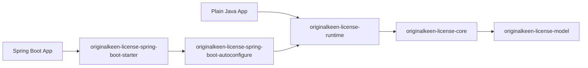

# OriginalKeen License V2 Design and Rollout

Status: active V2 design and execution set.

This directory no longer describes a purely hypothetical future. The repository now contains the first runtime-backed implementation slices, and this directory serves as the design and rollout reference that keeps those changes coherent.

## Current Status

- `originalkeen-license-runtime` now exists in the repository.
- Spring Boot auto-configuration now builds and exposes `LicenseRuntime`.
- `LicenseVerifyService` remains available as a compatibility bean in the first V2 release line.
- Web-only defaults have been moved into the Spring layer.
- [PLAN.md](PLAN.md) is the live execution record for what is finished and what still needs to be closed.

## How to Use This Directory

- If you want the product direction first, start with `architecture.md` and `runtime-api.md`.
- If you want implementation structure, continue with `config-finalization.md`, `interface-finalization.md`, `internal-assembly.md`, and `implementation-blueprint.md`.
- If you want rollout and compatibility guidance, finish with `migration-plan.md`, `spring-migration-guide.md`, `acceptance-checklist.md`, and `PLAN.md`.
- If you want to challenge assumptions that remain open, review `recommended-decisions.md` and `open-questions.md`.

## Why V2

The project already had a strong framework-free foundation in `model` and `core`, but the public experience was still centered on Spring Boot and expert-level manual assembly. V2 introduces and now implements a dedicated runtime layer so plain Java applications can use the license system without dealing with low-level bootstrap details.

## Main Decisions

- Keep `model` as the protocol contract shared across runtime and issuing workflows.
- Keep `core` as the low-level engine and expert extension layer with no Spring dependency.
- Add `originalkeen-license-runtime` as the public Java entry point for non-Spring usage.
- Keep `originalkeen-license-spring-boot-autoconfigure` and `originalkeen-license-spring-boot-starter`, but make them depend on `runtime` instead of wiring `core` directly.
- Keep Web-only concerns such as servlet filters and default exclude paths in the Spring layer.
- Migrate incrementally rather than rewriting the project in one step.

## Recommended Reading Order

If you want the fastest path through the V2 story, read in this order:

1. `architecture.md`
2. `runtime-api.md`
3. `config-finalization.md`
4. `interface-finalization.md`
5. `internal-assembly.md`
6. `implementation-blueprint.md`
7. `migration-plan.md`
8. `spring-migration-guide.md`
9. `acceptance-checklist.md`
10. `PLAN.md`

## Document Map

- [architecture.md](architecture.md): target module layout, dependency rules, and class ownership
- [runtime-api.md](runtime-api.md): runtime API baseline, public types, configuration model, and usage examples
- [config-finalization.md](config-finalization.md): implementation-oriented draft for builder fields, defaults, validation, and safe config exposure
- [interface-finalization.md](interface-finalization.md): implementation-oriented draft for the final runtime methods and Spring bean policy
- [internal-assembly.md](internal-assembly.md): how `runtime` assembles and wraps current `core`, plus the Spring migration path
- [implementation-blueprint.md](implementation-blueprint.md): package layout, class inventory, and implementation order
- [migration-plan.md](migration-plan.md): phased rollout and compatibility strategy
- [spring-migration-guide.md](spring-migration-guide.md): concrete migration notes for starter users and existing Spring beans
- [acceptance-checklist.md](acceptance-checklist.md): what the first V2 release should satisfy before it is considered complete
- [PLAN.md](PLAN.md): live execution summary of phases, deliverables, remaining items, and current status
- [recommended-decisions.md](recommended-decisions.md): current recommended defaults for implementation planning
- [open-questions.md](open-questions.md): remaining design refinements to confirm before implementation is fully closed

## Target Shape

## Non-Goals for V2

- Redesigning the license format or hardware matching rules
- Replacing TrueLicense in the same iteration
- Removing existing `core` APIs immediately
- Removing `LicenseVerifyService` compatibility exposure in the first V2 release line
- Adding new framework adapters beyond Spring Boot in the first phase
