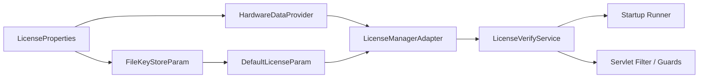
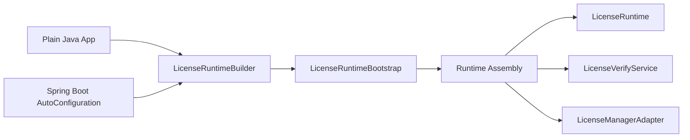
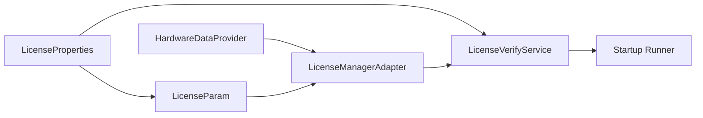
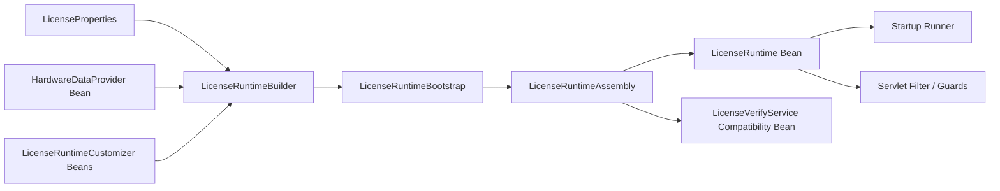

# V2 Internal Assembly Design

Status: implementation-oriented internal design draft.

This document explains how the proposed `runtime` module should be assembled on top of the existing `core` module, and how Spring Boot should switch from hand-wiring `core` directly to consuming the shared runtime bootstrap path.

## 1. Why This Document Exists

The earlier V2 documents already decide the module direction:

- `runtime` becomes the main framework-free public entry point
- `core` remains the low-level engine
- Spring Boot should consume `runtime`, not define the product shape

The remaining design gap is internal assembly:

- how `LicenseRuntime` is built from the existing `core` classes
- how install and verify operations should flow internally
- how Spring can expose compatibility beans without keeping its own duplicate assembly logic

## 2. Current V1 Assembly Path

Today the Spring Boot auto-configuration directly assembles the low-level stack:



Current source behavior confirms this:

- `LicenseAutoConfiguration` creates `HardwareDataProvider`, `LicenseParam`, `LicenseManagerAdapter`, and `LicenseVerifyService`
- `LicenseStartupAutoConfiguration` directly calls `licenseVerifyService.install(licensePath)` on startup
- plain Java users still have to do similar low-level assembly themselves

This is exactly the coupling that V2 is trying to remove.

## 3. Target V2 Assembly Shape

The runtime module should own the full bootstrap path once, and both plain Java and Spring should consume that same path.

Target shape:



The important shift is:

- user-facing code sees `LicenseRuntime`
- framework code may consume a richer assembly object
- only `runtime` knows how to build `core` correctly

## 4. Suggested Internal Runtime Types

Suggested runtime-side types:

| Type | Role |
| --- | --- |
| `DefaultLicenseRuntime` | concrete implementation of `LicenseRuntime` |
| `DefaultLicenseRuntimeBuilder` | builder implementation that collects and normalizes public config |
| `DefaultLicenseRuntimeConfig` | sanitized immutable config snapshot |
| `LicenseRuntimeBootstrap` | shared bootstrap logic that creates low-level `core` objects |
| `LicenseRuntimeAssembly` | infrastructure-facing bundle returned by bootstrap |
| `LicenseVerificationTranslator` | converts low-level exceptions or outcome details into V2 result and exception types |

Recommended posture:

- `DefaultLicenseRuntime`, builder implementation, and translator are normal runtime internals
- `LicenseRuntimeAssembly` exists mainly so the Spring adapter can consume the same bootstrap result
- if `LicenseRuntimeAssembly` or `LicenseRuntimeBootstrap` must be public because of the module boundary, they should still be documented as infrastructure-facing rather than first-wave application APIs

## 5. Suggested Assembly Contents

`LicenseRuntimeAssembly` should bundle the objects that are expensive or important to keep aligned:

| Assembly Field | Why It Exists |
| --- | --- |
| `LicenseRuntime runtime` | main public runtime instance |
| `LicenseRuntimeConfig config` | sanitized observable config |
| `LicenseVerifyService verifyService` | compatibility bean for Spring migration |
| `LicenseManagerAdapter licenseManager` | advanced diagnostics and internal result translation |
| `HardwareDataProvider hardwareDataProvider` | useful for Spring compatibility and debugging |

This avoids rebuilding the same low-level objects twice in different modules.

## 6. Bootstrap Pipeline

Recommended bootstrap flow:

1. Collect builder state from the public builder API.
2. Trim and normalize string inputs.
3. Validate required fields and password presence.
4. Resolve the effective `HardwareDataProvider`.
5. Resolve the effective preferences node name.
6. Build `FileKeyStoreParam`.
7. Build `DefaultLicenseParam`.
8. Build `LicenseManagerAdapter`.
9. Build `LicenseVerifyService`.
10. Build sanitized config and runtime wrapper.
11. Return a `LicenseRuntimeAssembly`.

Suggested low-level construction mapping:

| Runtime Concern | Existing Core or Third-Party Type |
| --- | --- |
| keystore loading | `FileKeyStoreParam` |
| classpath or filesystem key path support | `FileKeyStoreParam#getStream()` |
| TrueLicense parameter object | `DefaultLicenseParam` |
| password cipher parameter | `DefaultCipherParam` |
| hardware-aware verify engine | `LicenseManagerAdapter` |
| install, cache, and hot reload coordinator | `LicenseVerifyService` |

Suggested bootstrap sketch:

```java
LicenseRuntimeAssembly assemble(ResolvedRuntimeOptions options) {
    HardwareDataProvider provider = resolveProvider(options);
    Preferences preferences = Preferences.userRoot().node(options.effectivePreferencesNodeName());

    FileKeyStoreParam publicStore = new FileKeyStoreParam(
            DefaultLicenseRuntime.class,
            options.publicKeyStorePath(),
            options.publicAlias(),
            options.publicPasswordAsString(),
            null
    );

    LicenseParam licenseParam = new DefaultLicenseParam(
            options.subject(),
            preferences,
            publicStore,
            new DefaultCipherParam(options.publicPasswordAsString())
    );

    LicenseManagerAdapter manager = new LicenseManagerAdapter(licenseParam, provider);
    LicenseVerifyService verifyService = new LicenseVerifyService(manager, options.licensePath());
    LicenseRuntimeConfig config = DefaultLicenseRuntimeConfig.from(options, provider);
    LicenseVerificationTranslator translator = new LicenseVerificationTranslator();

    LicenseRuntime runtime = new DefaultLicenseRuntime(config, manager, verifyService, translator);
    return new LicenseRuntimeAssembly(runtime, config, verifyService, manager, provider);
}
```

## 7. Provider and Preferences Resolution

Recommended runtime behavior:

- if the caller provides a `HardwareDataProvider`, use it directly
- otherwise auto-resolve built-in Windows or Linux providers
- fail fast on unsupported operating systems
- use a stable explicit preferences node name instead of deriving it from implementation classes

Recommended default preferences node:

```text
/org/eu/originalkeen/license/runtime
```

This keeps runtime-owned persistence stable even if internal class names change later.

## 8. Install Flow

The existing `LicenseVerifyService.install(String)` already provides useful behavior:

- acquires write-side protection
- uninstalls the previous license before installing the new one
- clears verification cache after success
- refreshes the observed license-file timestamp

V2 should preserve that behavior instead of reimplementing it elsewhere.

Recommended runtime mapping:

```java
public void install(String licensePath) {
    try {
        verifyService.install(licensePath);
    } catch (RuntimeException ex) {
        throw translator.toInstallationException(licensePath, ex);
    }
}
```

Recommended `installIfPresent()` mapping:

1. read configured `licensePath` from runtime config
2. if path is null or blank, return `false`
3. if path does not currently exist or is unreadable, return `false`
4. otherwise call `install(path)`
5. if install succeeds, return `true`
6. if install fails, throw `LicenseInstallationException`

This keeps the startup-friendly tolerant behavior that the current Spring module already relies on.

## 9. Verify Flow

The current `LicenseVerifyService.verify()` behavior is:

1. if a configured license path exists and its timestamp changed, try hot reload first
2. if hot reload succeeds, treat the license as valid immediately
3. otherwise, if the short success cache is still fresh, return `true`
4. otherwise call `licenseManager.verify()`
5. cache only successful verification
6. never cache failures

That behavior is valuable and should remain the operational backbone in V2.

## 10. Result Translation Problem

There is one important design constraint in the current code:

- `LicenseVerifyService.verify()` returns only `boolean`
- on failure it swallows the underlying exception and returns `false`
- it does not expose whether success came from cache or from reload

This means the current method alone is not enough to fully populate the proposed V2 result model:

- `failureCode`
- `mismatchType`
- `fromCache`
- `reloaded`
- more precise messages

So V2 should not treat the current boolean method as the final information boundary.

## 11. Recommended Verification Translation Strategy

Recommended path:

- keep `LicenseVerifyService` in `core`
- keep its current boolean `verify()` as the simple expert-facing method
- add one richer internal outcome path that `runtime` can consume

Suggested options:

| Option | Recommendation |
| --- | --- |
| extend `LicenseVerifyService` with `verifyDetailed()` | recommended |
| add a separate internal helper around `LicenseVerifyService` and `LicenseManagerAdapter` | acceptable |
| duplicate cache and reload logic in `runtime` | not recommended |

Why the first option is best:

- it preserves the existing thread-safety and cache behavior in one place
- it avoids a second implementation of reload and lock rules
- it gives `runtime` access to the metadata needed for `LicenseVerificationResult`

Suggested internal outcome shape:

```java
public final class CoreVerificationOutcome {

    private final boolean valid;
    private final boolean fromCache;
    private final boolean reloaded;
    private final Throwable failure;
    private final LicenseContent content;
}
```

This outcome type does not need to become a main user-facing API. It can stay in the advanced or infrastructure lane.

## 12. Failure Code Translation Rules

The translator should map current low-level failures into stable V2 failure codes.

Recommended first-pass mapping:

| Low-Level Signal | V2 Mapping |
| --- | --- |
| `NoLicenseInstalledException` | `NOT_INSTALLED` |
| missing configured license file during optional install path | `LICENSE_FILE_MISSING` |
| expiration-related `LicenseContentException` | `EXPIRED` |
| certificate, notary, or signature verification failures | `SIGNATURE_INVALID` |
| `LicenseContentException` with IP mismatch message | `HARDWARE_MISMATCH` + `IP` |
| `LicenseContentException` with MAC mismatch message | `HARDWARE_MISMATCH` + `MAC` |
| `LicenseContentException` with CPU mismatch message | `HARDWARE_MISMATCH` + `CPU` |
| `LicenseContentException` with main-board mismatch message | `HARDWARE_MISMATCH` + `MAIN_BOARD` |
| keystore bootstrap or unsupported OS problems | `CONFIGURATION_ERROR` |
| install-time IO or runtime install failures | `INSTALLATION_ERROR` |
| anything else | `UNKNOWN_ERROR` |

Important note:

- some of this mapping may initially rely on existing exception types and messages from `core`
- that is acceptable for the first V2 implementation as long as the public V2 error surface stays stable
- if needed later, `core` can expose slightly more structured internal failure metadata without changing the public V2 API

## 13. Current Hardware Info Flow

`LicenseManagerAdapter` already exposes:

```java
LicenseCheckModel getServerHardwareInfo()
```

So `LicenseRuntime.currentHardwareInfo()` should simply delegate to the underlying manager or provider-backed path. No new engine behavior is required here.

## 14. Spring Before and After

### Current Spring path



### Target Spring V2 path



Recommended Spring assembly order:

1. create a runtime builder
2. apply `LicenseProperties`
3. apply a user-supplied `HardwareDataProvider` bean if present
4. apply ordered `LicenseRuntimeCustomizer` beans
5. bootstrap the runtime assembly
6. expose `LicenseRuntime` as the primary documented bean
7. optionally expose `LicenseVerifyService` from the assembly as a compatibility bean
8. make startup installation call `runtime.installIfPresent()`

## 15. Why Startup Should Move to `runtime.installIfPresent()`

The current Spring startup runner duplicates part of the runtime intent:

- it checks whether `licensePath` exists in configuration
- it decides whether installation should be skipped
- it directly calls the low-level service

In V2, this decision should belong to `runtime` instead:

- startup behavior stays consistent between plain Java and Spring
- tolerant handling of missing configured paths stays centralized
- the Spring module becomes thinner and easier to reason about

## 16. Final Recommendation

The recommended V2 internal assembly approach is:

- keep the existing verification engine in `core`
- add `runtime` as the owner of bootstrap and public semantics
- let `runtime` build `LicenseManagerAdapter` and `LicenseVerifyService`
- provide an infrastructure-facing assembly object so Spring does not keep wiring `core` directly
- preserve install, cache, and hot reload behavior from `LicenseVerifyService`
- add a richer internal verification outcome path so `runtime` can produce the planned structured result model without duplicating verification logic

This gives the project a clean product shape change without forcing a risky full rewrite of the current engine.
